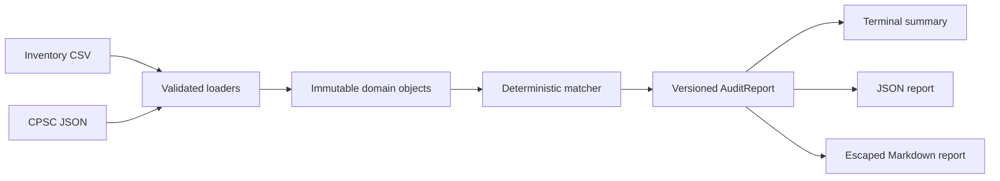

# Architecture

Recall Match keeps untrusted I/O at the edges and matching logic pure.

## Modules

| Module | Responsibility |
| --- | --- |
| `loaders.py` | File-size, encoding, CSV header/ID, JSON shape, and official field validation |
| `models.py` | Immutable internal contracts for inventory items, recalls, candidates, and results |
| `matching.py` | Unicode normalization, conservative evidence tiers, and stable ordering |
| `reporting.py` | Versioned report construction, freshness warnings, safe rendering, and atomic writes |
| `cli.py` | Argument parsing, clock/filesystem boundary, exit codes, and user-facing errors |

## Invariants

- Only exact normalized UPC or sufficiently specific model-plus-brand evidence can create `identifier_match`.
- Fuzzy name evidence can create only `review_candidate`.
- Candidate order does not depend on input recall order.
- Every candidate retains the source URL, recall ID/date, hazard, remedy, score, tier, and reasons.
- `no_candidate` is never rendered as a safety conclusion.
- Input URLs are data: they are never fetched or executed, and Markdown links are emitted only for valid HTTP(S) URLs.

The public CLI and JSON schema are frozen in [the specification](spec.md). The dependency/network boundary is recorded in [ADR-0001](decisions/0001-offline-zero-runtime-dependencies.md).

